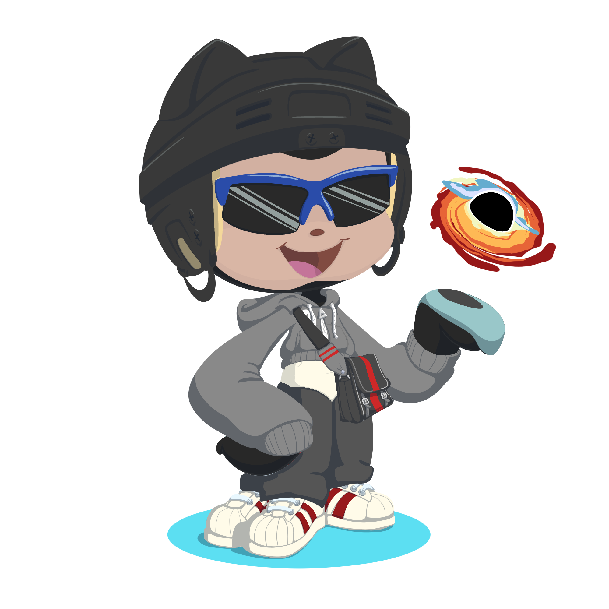

  

  <h1>Henrique Guedes Silvestre</h1>

  

    <strong>Software Engineering Student · Frontend Developer</strong>
  

  

    🚀 Focado em desenvolvimento web, interfaces modernas e aplicações completas
  

  
  
  

---

## 🚀 Sobre mim

Sou estudante de **Engenharia de Software na FIAP**, com foco em desenvolvimento web e criação de aplicações completas (front-end + back-end).

Tenho experiência prática com projetos reais, aplicando conceitos como:
- Manipulação de dados
- Integração com APIs
- Boas práticas de código
- Metodologias ágeis (Scrum)

💡 Busco minha primeira oportunidade como **Desenvolvedor Frontend / Full Stack**, onde eu possa gerar valor enquanto evoluo tecnicamente.

---

## 🧠 Stack Tecnológica

### 💻 Linguagens

### 🌐 Frontend

### ⚙️ Ferramentas & Metodologias

📌 Metodologias: **Scrum | Kanban | CI/CD | TDD**

---

## 💼 Experiência

**Assistente Técnico — MMG**  
📅 Jan 2023 – Jan 2024

- Organização e documentação técnica
- Apoio em projetos com AutoCAD
- Colaboração com diferentes áreas
- Desenvolvimento de soft skills (comunicação, trabalho em equipe e resolução de problemas)

---

## 🔥 Projetos em Destaque

### 🌐 Nexora — Landing Page Full Stack
> Projeto completo com integração entre front-end e back-end

- Interface moderna e responsiva  
- Validação de formulário  
- Envio via Fetch API  
- Backend em PHP + MySQL  
- Feedback visual para o usuário  

`HTML` `CSS` `JavaScript` `PHP` `MySQL`

---

### 🧾 Sistema de Cadastro (CRUD Web)
> Aplicação web com manipulação de dados

- CRUD completo  
- Manipulação de DOM  
- Organização de código  
- Responsividade  

`JavaScript` `HTML` `CSS`

---

### 🎮 Jogo do Número Secreto
> Projeto focado em lógica de programação

- Interação em tempo real  
- Validação de dados  
- Controle de fluxo  

`JavaScript`

---

### 🗂 Sistema de Restaurantes (CLI)
> Aplicação em Python via terminal

- Estruturas de dados  
- Organização de código  
- Simulação de sistema real  

`Python`

---

## 📊 Estatísticas

---

## 🌎 Idiomas

- 🇺🇸 Inglês: Intermediário (B1)  
- 🇪🇸 Espanhol: Básico (A2)

---

## 📈 Objetivo

Atuar como **Desenvolvedor Frontend ou Full Stack**, contribuindo com soluções eficientes, aprendendo continuamente e evoluindo dentro de um ambiente profissional com cultura ágil.

---

💬 *Aberto a oportunidades, colaborações e networking*

